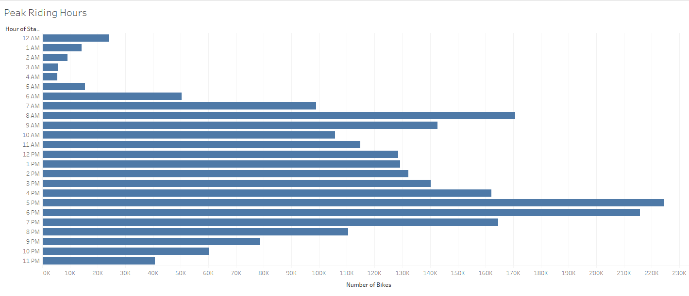
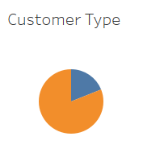
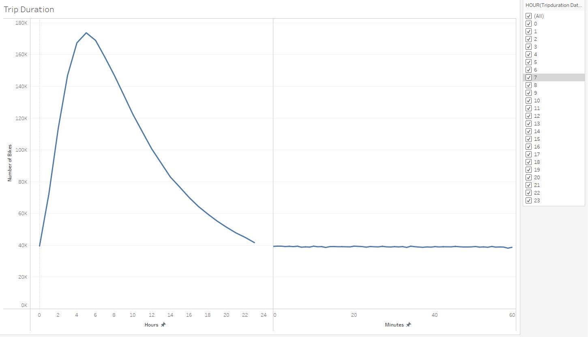
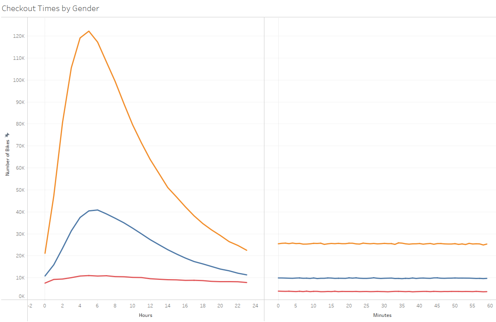
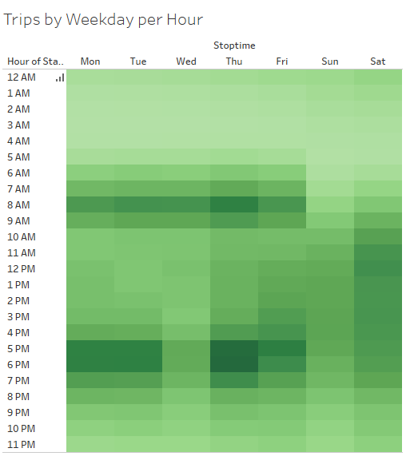
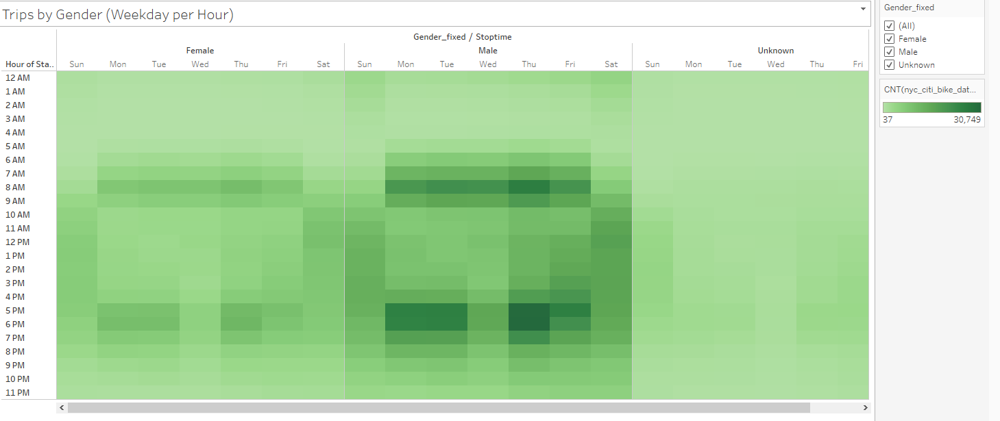
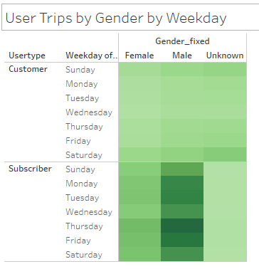

# Bike Rentals in NYC
### Using Tableau for Data Visualization

## Project Overview
I spent August in New York City with a friend. We had a fantastic time and realized upon returning home to Des Moines, Iowa that most of our fun involved a key component: a bike. We rented bikes from CitiBike, a popular bike rental company in the city. Could some of the fun we had in NYC be had in Des Moines with bikes? What about starting our own bike-rental start-up?! We started to get really excited. My friend approached her investor buddies and they signed us up for a pitch! To prepare for our presentation, I decided to analyze bikeshare data from NYC and put together a storyboard in Tableau. 

The Tableau story for Bike Rentals in NYC can be found in the following link: [Bike Rentals in NYC](https://public.tableau.com/app/profile/skye.stewart/viz/BikeRentalsinNYC/BikeRentalsinNYC?publish=yes)

### Purpose
The purpose of this analysis is to prepare a convincing pitch for investors in Des Moines, Iowa. We want to visually share how popular the bikeshare business is in NYC by showing bike rental characteristics.  

### Results
This analysis started by converting the trip_duration metric in the publically available datafile to a pandas datetime datatype for easier visualization of bike rental trip duration. 
### 1. Peak Riding Hours
The most popular times to rent a bike peak during normal business hours, around 8am and between 5-7pm. Daylight hours are generally more popular than evening as can be seen by the number of bikes displayed on the bar chart.

### 2. Customer Type
The majority of bike renters are subscribers to the bike share business. They represent over three quarters of the customer base as demonstrated by the orange section of pie.

### 3. Trip Duration
This image shows us that trips can be substantial in terms of duration. In a 24-hour day, we see that the majority of trips center around 5-hours. It is important to note this as ridership picks up, we will want to ensure enough bikes are available to rent at peak hours as they are checked out for several hours, on average.

### 4. Trip Duration by Gender
Here we see trip duration by gender. What is noticed immediately is that one gender surpasses the other in terms of bike rentals. Males peak at over 120,000 rentals while females are at 40,000 and uncategorized at just 10,000. For males and females, trip duration centers around 5-hours as observed in the previous image.

### 5. Trips by Weekday per Hour
Heatmaps are a neat way of illustrating "hot" times (in this case). The more popular/hot days and times for bike rentals are shown in darker green. Once we orient ourselves to the graph, you can see that during the week, popular bike rental times circle around business start and end times also known as commuting hours (7-9am and 5-7pm) We do see that Sundays are popular as well and that bike rental is spread throughout the daylight hours in contrast to the start and end of the workday during the week.

### 6. Trips by Gender (Weekday per Hour)
This heatmap further breaks down the previous heatmap by showing popular times for bike rental by gender. We see similar trends as before with darker green showing up during commuting hours and weekend daylight hours. However, it is clear that bike renting is much more popular among males as can be seen by the much darker green in the middle section of the heatmap. 

### 7. Trips by Gender, Subscriber Type, and Day of Week
This combined heatmap shows us that the most popular user of the bike rental service is typically male, a subscriber, and riding more frequently on weekdays. This is clear by the much darker green color.

### Summary
Bike renting is popular in New York City. We think given the benefits for our community and the potential business opportunity, this business is worth investing in. It is clear that in New York City, bike renting is most popular among working males who use bikes for commuting to work as well as for leisure on the weekend. We think there is an opportunity to expand the market to include more women and people from other gender communities. There is more work to be done!

Additional visualizations that could support our analysis with the available date include 1) trip duration and usage by birth year and 2) comparing start and end stations between usertype or genders. 

Before kicking off this company, it would be worth interviewing women and people from other gender communities to better understand the barriers to their ridership. The barriers may not be applicable in Des Moines but if they are, we'd like to overcome the to improve bike rental desirability. 
